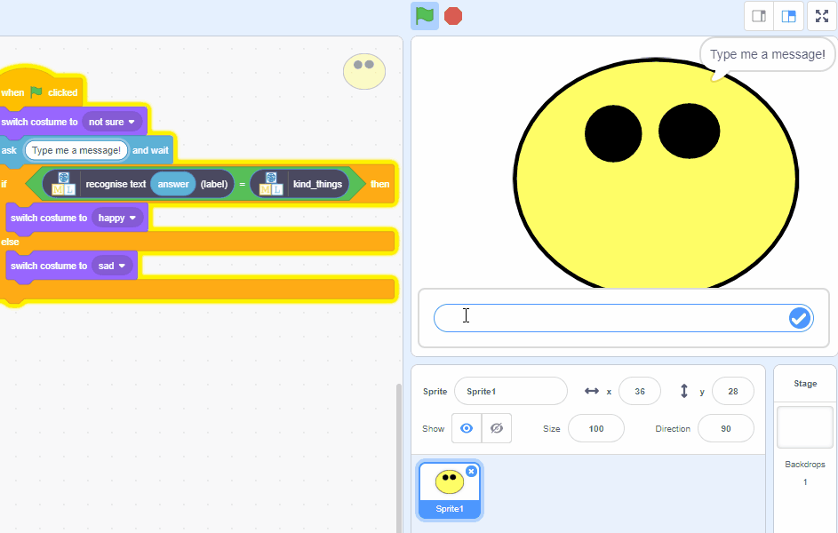
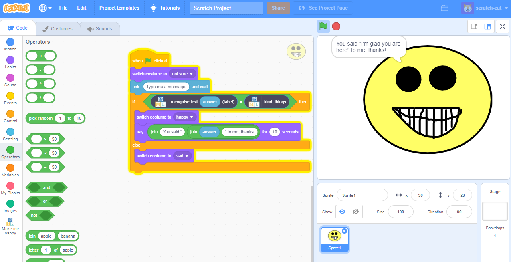

## Introduction

In this project you will use [machinelearningforkids.co.uk](machinelearningforkids.co.uk) to make a character that reacts to what you say. If you say something kind, it will smile. If you say something mean, it will cry.
To start with, you’ll program a list of rules for understanding messages, and learn why that approach isn’t very good.
Next, you will teach the computer to recognise messages as kind or mean by giving it examples of each.

### What you will make
--- no-print ---

--- /no-print ---

--- print-only ---

--- /print-only ---
--- collapse ---
---
title: What you will learn
---

+ How to train and test a machine learning model
+ Why this approach is better than using a long list of rules
+ How to use a trained model in a Scratch 3 program

--- /collapse ---

--- collapse ---
---
title: What you will need
---
### Hardware

+ A computer connected to the internet

### Software

+ An account on machinelearningforkids.co.uk (optional)

--- /collapse ---

--- collapse ---
---
title: Additional information for educators
---

If you need to print this project, please use the [printer-friendly version](https://projects.raspberrypi.org/en/projects/make-me-happy/print){:target="_blank"}.

[Here is a link to the resources for this project -TODO-](http://rpf.io/project-name-go).

--- /collapse ---

### License

This project is dual-licensed under both a [Creative Commons Attribution Non-Commercial Share-Alike License](http://creativecommons.org/licenses/by-nc-sa/4.0/){:target="_blank"} and an [Apache License Version 2.0](http://www.apache.org/licenses/LICENSE-2.0){:target="_blank"}
