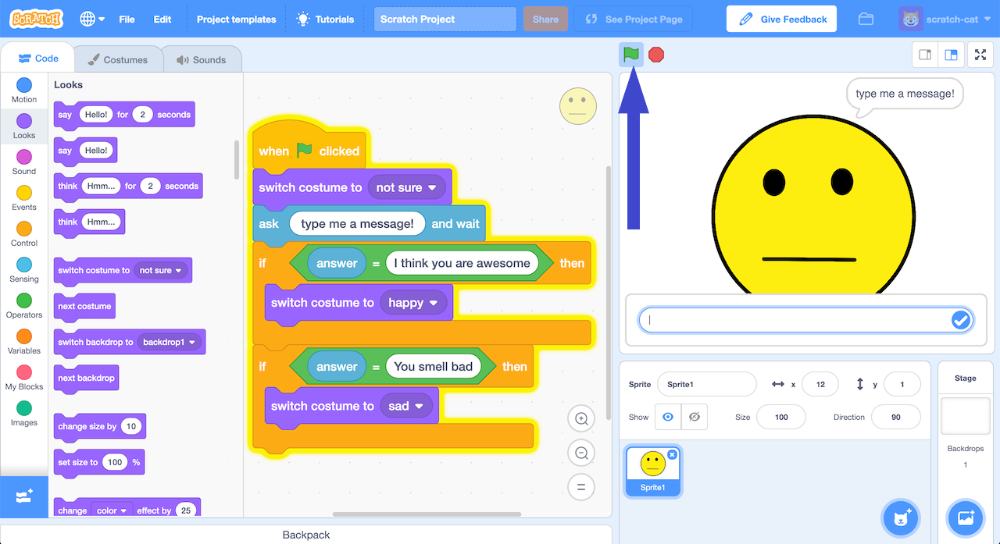

## Using a list of rules

In this step, you will include a list of rules to change the costume to happy or sad.

--- task ---
+ Click on the **Code** tab and enter the following code. 

```blocks3
when green flag clicked
switch costume to (not sure v)
ask [type me a message!] and wait
if <(answer) = [I think you are awesome]> then
switch costume to (happy v)
end
if <(answer) = [You smell bad]> then
switch costume to (sad v)
end
```

+ Save your project. Click on **File -> Save to your computer** to save the project to a file.
--- /task ---

--- task ---

+ Click on the **green flag** to test. 


+ Type in a message and watch it react! Type “I think you are awesome” and press enter. The character smiles. Click the green flag again and type “You smell bad”. The character cries. Type anything else, and the character’s face won’t change.
--- /task ---

You’ve created a character that should react to what people type, and programmed it using a simple rules-based approach.
If you want it to react to other messages, you need to add more **if** blocks.
The problem with this is that you need to predict exactly what messages the character will receive. Making a list of every possible message would take forever!
Next, we’ll try a better approach – teaching the computer to recognise messages for itself.