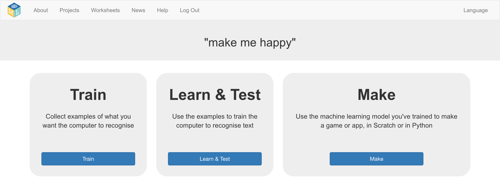
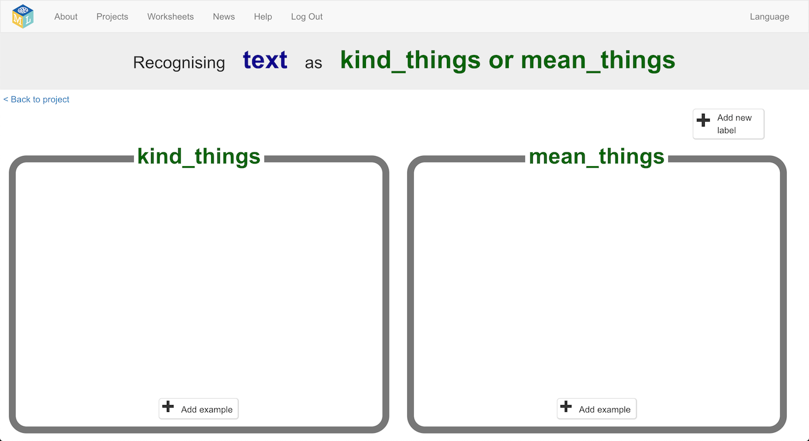

## Collect examples for your machine learning model

--- task ---
+ Close the Scratch window and go back to the Training tool.

+ Click on the **< Back to project** link.
--- /task ---

--- task ---
+ We need to collect some examples to train the computer. Click the **Train** button.

+ Click on **+ Add new label** and call it “kind things”.  Do that again, and create a second bucket called “mean things”. 

+ Click on the **Add example** button in the “kind things” bucket, and type in the nicest, kindest compliment you can think of. 

+ Click on the **Add example** button in the “mean things” bucket, and type in a meanest, cruellest insult you can think of. 
--- /task ---

--- task ---
+ Continue to **Add example**s until you have got at least **six** compliments and **six** insults.

--- collapse ---
---
title: Tips for selecting good examples
---
+ **More examples!**: The more examples you give it, the better the computer should get at recognising whether a message is kind or mean. 

+ **Try and be even**: Try and come up with roughly the same number of examples for kind and mean. If you have a lot of examples for one type, and not the other, the computer might learn that type is more likely, so you’ll affect the way that it learns to recognise messages. 

+ **Mix things up with your examples**: Try to come up with lots of different types of examples. For example, make sure that you include some long examples and some very short ones. 
--- /collapse ---
--- /task ---

In the next step you will train your machine to recognise whether your message is a compliment or an insult and automatically put it in one of the 2 buckets based on the examples you have added.