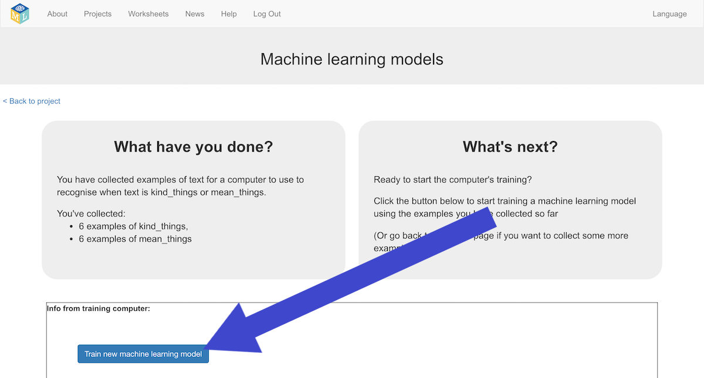
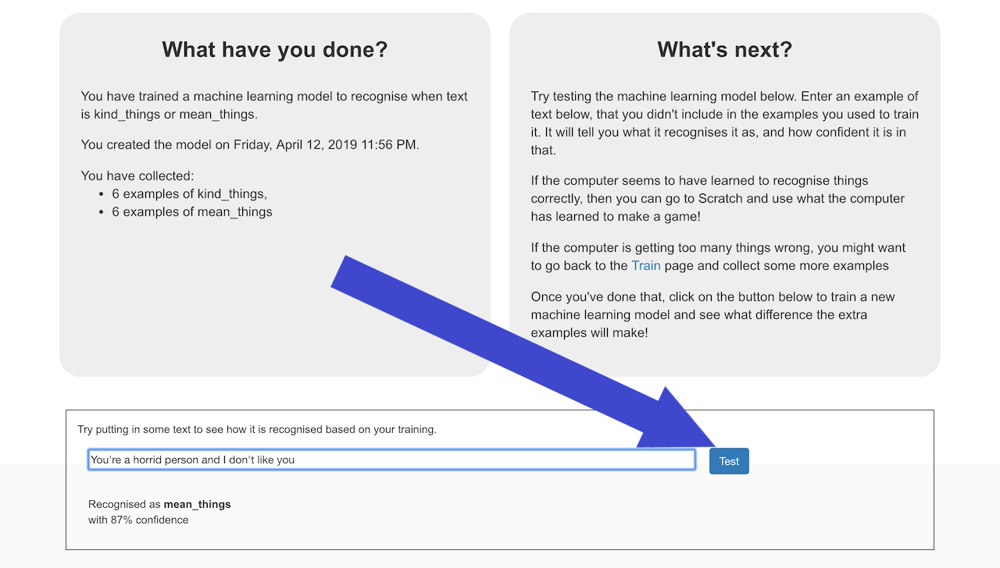

## Training and testing your machine learning model

--- task ---
+ Click on the **< Back to project** link, then click **Learn & Test**

+ Click on the **Train new machine learning model** button. As long as you’ve collected enough examples, the computer should start to learn how to recognise messages from the examples you’ve given to it.

--- /task ---

Wait for the training to complete. This might take a minute.

--- task ---
Once the training has completed, a Test box will be displayed. Try testing your machine learning model to see what it has learned. 
+ Type something kind, and press enter. It should be recognised as kind.
+ Type something mean, and press enter. It should be recognised as mean.
+ Test it with examples that you haven’t shown the computer before.
If you’re not happy with how the computer recognises the messages, go back to the previous step and add some more examples. 
Make sure you repeat this step to train with the new examples though!

--- /task ---

You’ve started to train a computer to recognise text as being kind or mean. Instead of trying to write rules to be able to do this, you are doing it by collecting examples. These examples are being used to train a machine learning “model”.
This is called “supervised learning” because of the way you are supervising the computer’s training.
The computer will learn from patterns in the examples you’ve given it, such as the choice of words, and the way sentences are structured. These will be used to be able to recognise new messages. 